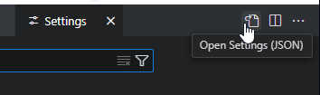

# Google Cloud Shell

Google Cloud Shell Editor is based on the codeoss project (the base of vscode).

## Customize .bashrc

This reflects customizations to adjust the editor and terminal that are part of the editor.  This is not the complete .bashrc with everything custom in it.

```bash
FONT_NAME="FiraMono"
FONT_URL="https://github.com/ryanoasis/nerd-fonts/releases/download/v3.2.1/FiraMono.zip"
FONT_DIR="$HOME/.local/share/fonts"
if ! fc-list : family | grep -q "$FONT_NAME"; then
    echo "$FONT_NAME font is not installed. Downloading and installing..."
  
    if [ ! -d "$FONT_DIR" ]; then
        mkdir -p "$FONT_DIR"
    fi
  
    wget -O "$FONT_DIR/FiraMono.zip" "$FONT_URL"
    unzip "$FONT_DIR/FiraMono.zip" -d "$FONT_DIR"
    rm "$FONT_DIR/FiraMono.zip"
  
    # Refresh the font cache
    fc-cache -fv
  
    echo "$FONT_NAME font installed successfully."
fi

OHMYPOSH_BIN=${LOCAL_BIN_DIR}/oh-my-posh
if [ ! -f ${OHMYPOSH_BIN} ]; then
    # install oh-my-posh
    echo "oh-my-posh binary not found.  Installing now"
    curl -s https://ohmyposh.dev/install.sh | bash -s -- -d ${LOCAL_BIN_DIR}
fi


##### ADD THIS TO THE END OF BASHRC TO INIT THE PROMPT #####
# install oh-my-posh and add eval line to .bashrc
# curl -s https://ohmyposh.dev/install.sh | bash -s -- -d ~/.local/bin
# export current theme to customize it:
# oh-my-posh config export --output ~/.mytheme.omp.yaml
# insert the below block in the theme between the session and path segments
#   - type: gcp
#     style: powerline
#     powerline_symbol: 
#     foreground: "#ffffff"
#     background: "#47888d"
#     template: "  {{.Project}} "

if [ -f ${OHMYPOSH_BIN} ]; then
    eval "$(oh-my-posh init bash --config ~/.mytheme.omp.yaml)"
    # now exec bash to reload
fi
```

## Customize settings.json

Because of how GCP is based on codeoss, the standard `~/.vscode/settings.json` path doesn't seem to work. Using `ctrl + ,` in the IDE will open the settings file in UI mode.  You can then switch to the actual settings file by clicking the `Open Settings (JSON)` icon:


