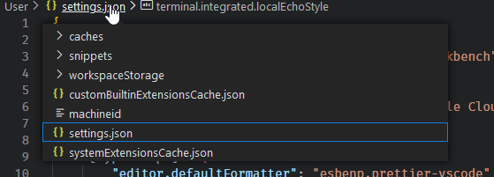

# GCP Cloudshell Notes / Discovery

## User settings

The [documentation for vscode](https://code.visualstudio.com/docs/getstarted/settings#_user-settingsjson-location) says the User settings file is located at `$HOME/.config/Code/User/settings.json`.  However in Google Cloudshell it isn't located there.  Google Cloudshell editor is based on CodeOSS, and for their purposes, the User `settings.json` is stored under `~/.codeoss/data/User/History/RANDOM_DIR/RAND_FILENAME.json`.  I am not sure why this is, but it took me a while to figure this one out.

```bash

find ~ -type d -name 'User'
```


