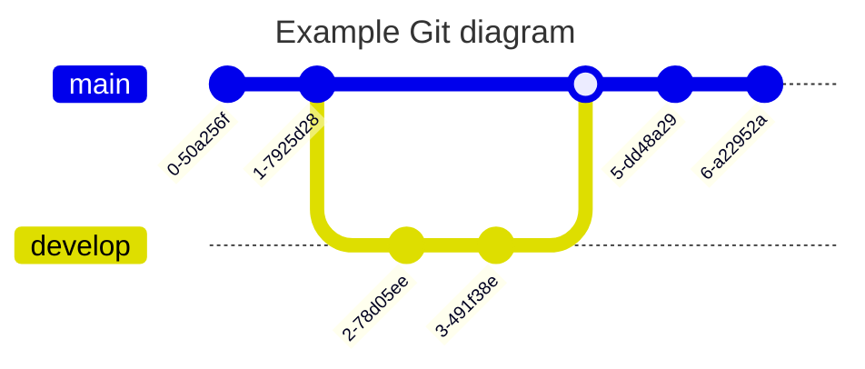
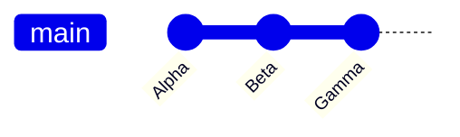

```mermaid
---
title: Example Git diagram
---
gitGraph
   commit
   commit
   branch develop
   checkout develop
   commit
   commit
   checkout main
   merge develop
   commit
   commit
```
Another:

```mermaid
    gitGraph
       commit id: "Alpha"
       commit id: "Beta"
       commit id: "Gamma"
```
