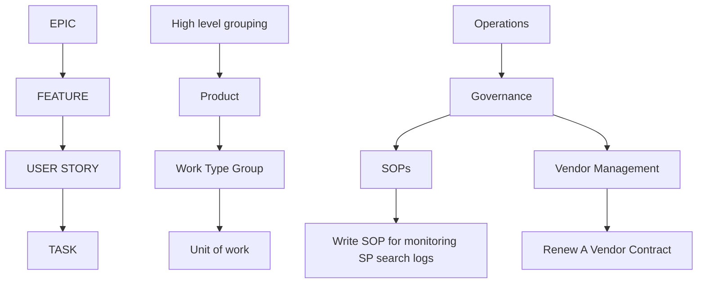
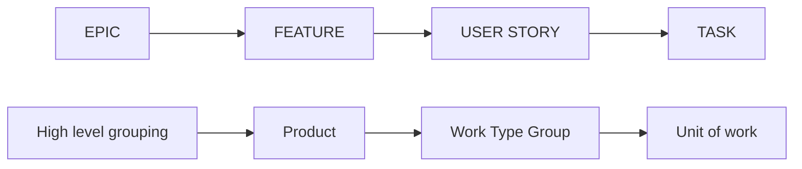
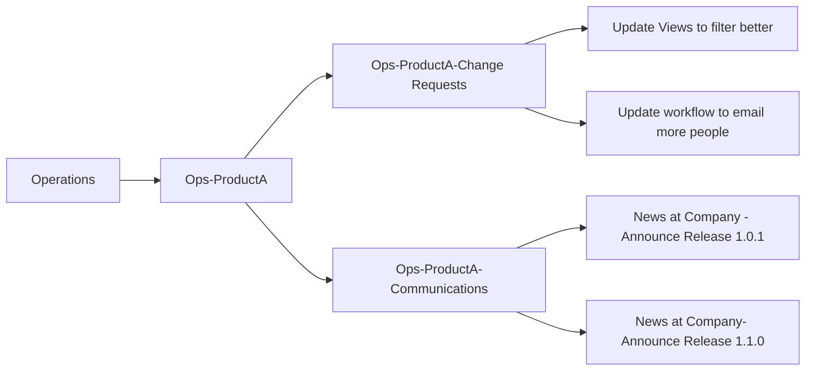
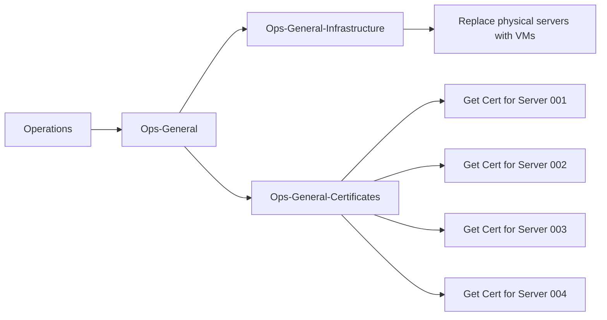

Skip to content
Navigation Menu
tcaky
/
WikiMeThis

Type / to search
Code
Issues
1
Pull requests
Actions
Projects
1
Wiki
Security
Insights
Settings
Editing Mermaid graph example
 
 
Mermaid graph example
Write
Preview
    
Edit mode: 
Markdown
### Description of overall purpose of how we are currently using boards in the EC3 project.
 

### As above, but from Left to right (displays more complex hierarchy better):

 
### Another example:

 
### Last example:

No file chosen
Attach files by dragging & dropping, selecting or pasting them.
Edit message
Write a small message here explaining this change. (Optional)
Footer
© 2024 GitHub, Inc.
Footer navigation
Terms
Privacy
Security
Status
Docs
Contact
Manage cookies
Do not share my personal information
Editing Mermaid graph example · tcaky/WikiMeThis Wiki